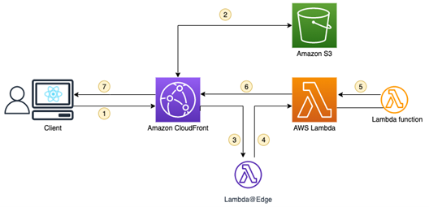

# Primeiro Titulo

O primeiro titulo tem como base trazer a possibilidade de validar a conversão
do arquivo PDF em Markdown.

##  Bloco de código

Abaixo será apresentado um bloco de código.

    
    
    import argparse
    import html2text
    
    class HTMLToMarkdownConverter:
        def __init__(_self_):
            _self_.converter = html2text.HTML2Text()
    
        def convert(_self_ , html_content):
            markdown_content = _self_.converter.handle(html_content)
            return markdown_content
    
        def convert_file(_self_ , html_file_path):
            with _open_(html_file_path, 'r', encoding='utf-8') as file:
                html_content = file.read()
            markdown_content = _self_.convert(html_content)
            return markdown_content
    
        def save_as_markdown(_self_ , markdown_content, markdown_file_path):
            with _open_(markdown_file_path, 'w', encoding='utf-8') as file:
                file.write(markdown_content)
    
    def main():
        parser = argparse.ArgumentParser(description='Convert HTML to Markdown')
        parser.add_argument('html_file', help='Path to the HTML file')
        parser.add_argument('markdown_file', help='Path to write the Markdown file')
        args = parser.parse_args()
    
        converter = HTMLToMarkdownConverter()
        markdown_output = converter.convert_file(args.html_file)
        _print_(markdown_output)
    
        # Salvar como arquivo Markdown
        converter.save_as_markdown(markdown_output, args.markdown_file)
    
    if ___name___ == "__main__":
        main()
    

##  Imagem

Neste campo iremos apresentar uma imagem e verificar o seu resultado
convertido.

  
  

## Estrutura de Tópicos

Apresentando estrutura de tópicos.

### Marcadores

  * Opção 1

  * Opção 2

  * Opção 3

### Numeros

  1. Primeiro

  2. Segundo

  3. Terceiro

    1. Primeiro do Terceiro

    2. Segundo do Terceiro

      1. Primeiro do Segundo do Terceiro

  4. Quarto

  
  

  
  

  
  

